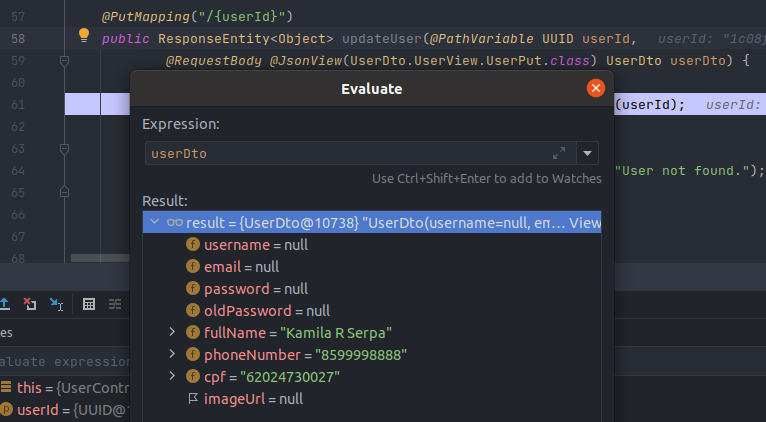

# Microservice Authuser

## @JsonView

A utilização da anotação @JsonView em determinadas propriedades de [UserDto](src/main/java/com/ead/authuser/dtos/UserDto.java) faz com que o recurso anotado com a anotação `@JsonView(Interface.class)` passe a gerenciar apenas propriedades com a mesma anotação. 
Podendo uma propriedade ser anotada com mais de uma interface.

Controller:
```java
public ResponseEntity<Object> updateUser(@PathVariable UUID userId,
@RequestBody @JsonView(UserDto.UserView.UserPut.class) UserDto userDto) {
```

Model:
```java
 @JsonView({UserView.RegistrationPost.class, UserView.UserPut.class})
    private String fullName;
```
Recurso desserializa apenas as propriedades especificas anotadas com `@JsonView(UserDto.UserView.UserPut.class)`:


## BeanValidation

Habilitando validação apenas para determinadas Views do Jackson inserindo o atributo "groups" na anotação da propriedade model:
`@NotBlank(groups = UserView.PasswordPut.class)`.

No controller inserir a anotação `@Validated` informando a View a ser utilizada para validação.
```java
    @PutMapping("/{userId}")
    public ResponseEntity<Object> updateUser(@PathVariable UUID userId,
    @RequestBody @Validated(UserDto.UserView.UserPut.class)
    @JsonView(UserDto.UserView.UserPut.class) UserDto userDto) { .. } 
```

## Filtros avançados com Specification Argument Resolver

Utiliza a biblioteca [Specification Argument Resolver](https://github.com/tkaczmarzyk/specification-arg-resolver) na qual implementa o filtro de busca pelos parâmetros enviados na requisição.
A classe [SpecificationTemplate](src/main/java/com/ead/authuser/specifications/SpecificationTemplate.java) contém a interface `UserSpec` que controla a lógica de filtragem.

Então é possível adicionar o parâmetro `spec` como parâmetro do método getAllUsers

```java
   @GetMapping
    public ResponseEntity<Page<UserModel>> getAllUsers(
            SpecificationTemplate.UserSpec spec,
            @PageableDefault(page = 0, size = 10, sort = "id", direction = Sort.Direction.ASC) Pageable pageable) {
        ...
    }
```
<b>Atenção</b>, o projeto _Specification Argument Resolver_ teve sua última release em 2020. Para projetos de grande porte a utilização de Specification e Criteria Builder de maneira nativa com Spring Data. 

[ResolverConfig](src/main/java/com/ead/authuser/configs/ResolverConfig.java) foi criada para adicionar _resolvers_, para que a API esteja preparada para converter os dados dos parâmetros HTTP (string) para tipos básicos Java (Enum, LocalDate, LocalDateTime, Double, Float, etc).
 
<b>Observação</b>, pesquisar a diferença de `WebMvcConfigurationSupport` para `WebMvcConfigurer`.